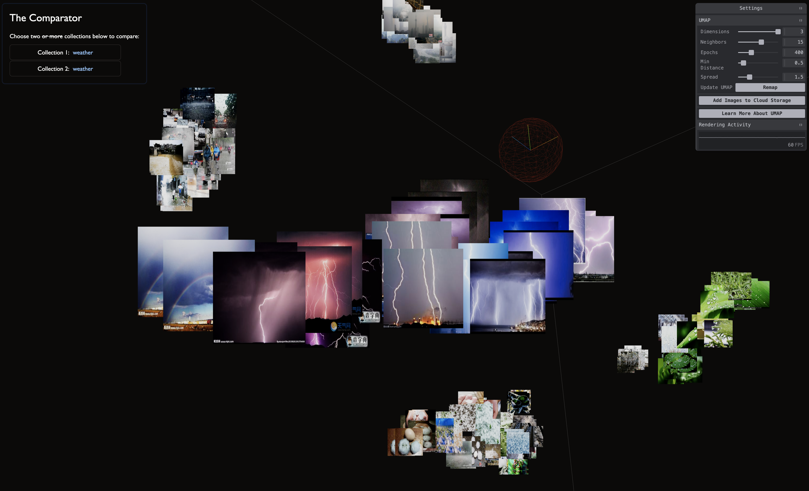

> **This repo is provided _as-is_ for reference**, since you need a Firebase project with at least one collection that contains embeddings, and the proper APIs enabled (with billing) to generate embeddings.

> **NEW!** While not _fully_ functional, the repo now includes exported Firebase emulator data so you can get up and running quicker, follow along below!

# Multimodal Embeddings Demo

[Check out this video](https://x.com/labsdotgoogle/status/1838686949835706607) on the [Labs.google](https://labs.google) X account to see a quick overview of the project:

[](https://x.com/labsdotgoogle/status/1838686949835706607)

> Unsure what embeddings are? [Here's an old video](https://www.youtube.com/watch?v=wvsE8jm1GzE) we made about visualizing embeddings that does a good job explaining the basics. Learn more about Multimodal Embeddings in the [Cloud docs here](https://cloud.google.com/vertex-ai/generative-ai/docs/embeddings/get-multimodal-embeddings).

This repo represents most of the code used in Khayti's "Personal Search" demo in the video above, with two endpoints that can be used to explore your own embeddings:

1. `/search` - where we use Firebase Vector Search to find the closest embeddings to _both_ text and image input (image search!), and
2. `/viz` - bonus! where we use [UMAP](https://pair-code.github.io/understanding-umap/) to reduce the dimensions of our embeddings to visualize their relationships in 3D.

The app is built with Firebase and SvelteKit, which uses Threlte for a declarative 3D rendering engine built on top of THREE.js (for `/viz`).

## Get Started

We'll be able to test quickly with some exported Firebase Emulator data so let's dive right in:

1. [Create a new project](https://firebase.google.com/docs/web/setup) in Firebase that has Functions, Firestore and Storage enabled.
2. Run `firebase init` within this folder, enabling Firestore, Storage and Emulators to quickly be able to test with emulator data.
3. Update `/src/lib/consts.ts` with your firebase project info.
4. `npm i && npm run dev:emulate` should now work, building the site and starting the emulators. You can test this by visiting [`http://localhost:5173/viz`](http://localhost:5173/viz), which should load in the provided 'Weater' dataset.
5. Optional - Get a Gemini API key for any Gemini-related extra tasks.

> `firebase init` creates some files, like `firebase.rc` and some rules for Firestore and Firebase Storage. If you run into errors like the 'weather' images not loading in `/viz`, it could be the storage rules being set to 'false' as opposed to something that allows them to be loaded. Learn more in the `Visualizing` section below.

### Firebase Cloud Function for Embedding Generation

We've included a little bonus here in `/fb/functions` that can _automatically_ generate embeddings for files uploaded to your Cloud Bucket. It also generates collections based on the folder structure of the uploads.

This was great for our team when we were prototyping with the API since anyone could just create a new folder, upload images, and have it available in the UI for exploration.

Check out [`/fb/README.md`](fb/README.md) for more info.

> Note: you _can_ get this to run in the emulator as well, but its out of scope for this already too-long doc.

There are a bunch of utility methods and components as well in `/src/lib`, but most importantly used by `/search` and `/viz` is `/src/lib/components/CollectionList.svelte` which will attempt to pull in any Firestore Collections created by the function in `/fb/functions` (if you choose to use that).

### Create embeddings yourself

Read through the [Multimodal Embeddings documentation](https://cloud.google.com/vertex-ai/generative-ai/docs/embeddings/get-multimodal-embeddings) as our code in `/src/lib/embedder.ts` implements this almost exactly. You'll need to add your project name to this file as well for it to work. You send text, images, or video, and receive back a vector that needs to be store in Firebase.

> `embedder.ts` is also called directly from the Function in `/fb/functions/index.ts` so we didn't have to have two copies of the code in each sub module.

### I have embeddings, now what?

Next, read through the [Firebase Vector Search docs](https://firebase.google.com/docs/firestore/vector-search).

You'll store each image embedding in [a Firestore document](https://firebase.google.com/docs/firestore/vector-search#write_operation_with_a_vector_embedding) via `FieldValue.vector()`, and once you've done this for all your embeddings, you'll need to [create an index of that collection](https://firebase.google.com/docs/firestore/vector-search#create_and_manage_vector_indexes) so the Vector Search can work.

If you have _not_ created an index, but go to `/search` and try to search your collection, you'll get a handy error that gives you the exact code to run in order to start that, something like this:

```bash
gcloud firestore indexes composite create \
--collection-group=collection-group \
--query-scope=COLLECTION \
--field-config field-path=vector-field,vector-config='vector-configuration' \
--database=your-database-id
```

Once indexed, your collection can be searched!

### Searching

Again, everything in this repo follows the [Firebase Vector Search docs](https://firebase.google.com/docs/firestore/vector-search) closely, and for searching, we're [making a nearest-neighbor query](https://firebase.google.com/docs/firestore/vector-search#make_a_nearest-neighbor_query).

Conceptually though, you're doing two things:

1. Embedding _the query_ in order to place it within the same space as your collections embeddings, then
2. Doing a nearest-neighbor lookup to find any results that are nearby to your query.

And since we're using the Multimodal Embeddings API, your query can be text, an image, or a video.

**Important Note** - you'll notice that we also have a file `/src/lib/cloud-firebase.ts`. At time of creating this demo, the actual Search APIs only resided in `@google-cloud/firestore` on NPM, which is separate from the normal Firebase web APIs in npm's `firebase` that are used elsewhere in the app.

### Visualizing

`/viz` takes your Firestore collections and attempts to plot them in 3D using UMAP, an API similar to T-SNE but much faster (and just as non-deterministic).

<figure>
  
  <figcaption>/viz using the public weather dataset mentioned above</figcaption>
</figure>

It was a WIP that was never fully completed but should get you 90% of the way there. What's important to note is lowering dimensions on embeddings inherently loses information, so while its a really nice way to visualize things it shouldn't be considered an exact representation of the embeddings (which are 1408 dimensions).

## Experiments for all

This is an experiment, not an official Google product. We’ll do our best to support and maintain this experiment but your mileage may vary.

We encourage open sourcing projects as a way of learning from each other. Please respect our and other creators’ rights, including copyright and trademark rights when present, when sharing these works and creating derivative work. If you want more info on Google's policy, you can find that [here](https://www.google.com/permissions/).

> **This repo is provided _as-is_ for reference**, since you need a Firebase project with at least one collection that contains embeddings for it to be functional. We'll go through the basics of getting that setup next, but be warned - it's not yet plug-and-play :)

# Multimodal Embeddings Demo

Check out this video on Labs.google to see a quick overview of the project:

[Video Screenshot]

> Unsure what embeddings are? [Here's an old video](https://www.youtube.com/watch?v=wvsE8jm1GzE) we made about visualizing embeddings that does a good job explaining the basics. Learn more about Multimodal Embeddings in the [Cloud docs here](https://cloud.google.com/vertex-ai/generative-ai/docs/embeddings/get-multimodal-embeddings).

This repo represents most of the code used in Khayti's "Personal Search" demo in the video above, with two endpoints that can be used to explore your own embeddings:

1. `/search` - where we use Firebase Vector Search to find the closest embeddings to _both_ text and image input (image search!), and
2. `/viz` - bonus! where we use [UMAP](https://pair-code.github.io/understanding-umap/) to reduce the dimensions of our embeddings to visualize their relationships in 3D.

The app is built with Firebase and SvelteKit, which uses Threlte for a declarative 3D rendering engine built on top of THREE.js (for `/viz`).

## Get Started

In addition to the Firebase project, you'll also need an API key for the embedding calls to Gemini so:

1. [Create a new project](https://firebase.google.com/docs/web/setup) in Firebase that has Functions, Firestore and Storage enabled.
2. [Get an API key (via the console or AI Studio)](https://aistudio.google.com/app/apikey) for your Gemini calls and then create a `.env` file with your `GEMINI_API_KEY=yourkeyhere` in this directory.
3. Update `/src/lib/consts.ts` with your project info.
4. `npm i && npm run dev` should now 'work', but you won't have any data to explore until you create some embeddings.

> Don't have any data to embed? We initially used public open source data sets available on places like Kaggle and Hugging Face to test our ideas. [This weather dataset](https://www.kaggle.com/datasets/jehanbhathena/weather-dataset) was a great starting place, as it visualizes really nicely.

### Firebase Cloud Function for Embedding Generation

We've included a little bonus here in `/fb/functions` that can _automatically_ generate embeddings for files uploaded to your Cloud Bucket. It also generates collections based on the folder structure of the uploads.

This was great for our team when we were prototyping with the API since anyone could just create a new folder, upload images, and have it available in the UI for exploration.

Check out [`/fb/README.md`](/fb/README.md) for more info.

There are a bunch of utility methods and components as well in `/src/lib`, but most importantly used by `/search` and `/viz` is `/src/lib/components/CollectionList.svelte` which will attempt to pull in any Firestore Collections created by the function in `/fb/functions` (if you choose to use that).

### Create embeddings yourself

Read through the [Multimodal Embeddings documentation](https://cloud.google.com/vertex-ai/generative-ai/docs/embeddings/get-multimodal-embeddings) as our code in `/src/lib/embedder.ts` implements this almost exactly. You'll need to add your project name to this file as well for it to work. You send text, images, or video, and receive back a vector that needs to be store in Firebase.

> `embedder.ts` is also called directly from the Function in `/fb/functions/index.ts` so we didn't have to have two copies of the code in each sub module.

### I have embeddings, now what?

Next, read through the [Firebase Vector Search docs](https://firebase.google.com/docs/firestore/vector-search).

You'll store each image embedding in [a Firestore document](https://firebase.google.com/docs/firestore/vector-search#write_operation_with_a_vector_embedding) via `FieldValue.vector()`, and once you've done this for all your embeddings, you'll need to [create an index of that collection](https://firebase.google.com/docs/firestore/vector-search#create_and_manage_vector_indexes) so the Vector Search can work.

If you have _not_ created an index, but go to `/search` and try to search your collection, you'll get a handy error that gives you the exact code to run in order to start that, something like this:

```bash
gcloud firestore indexes composite create \
--collection-group=collection-group \
--query-scope=COLLECTION \
--field-config field-path=vector-field,vector-config='vector-configuration' \
--database=your-database-id
```

Once indexed, your collection can be searched!

### Searching

Again, everything in this repo follows the [Firebase Vector Search docs](https://firebase.google.com/docs/firestore/vector-search) closely, and for searching, we're [making a nearest-neighbor query](https://firebase.google.com/docs/firestore/vector-search#make_a_nearest-neighbor_query).

Conceptually though, you're doing two things:

1. Embedding _the query_ in order to place it within the same space as your collections embeddings, then
2. Doing a nearest-neighbor lookup to find any results that are nearby to your query.

And since we're using the Multimodal Embeddings API, your query can be text, an image, or a video.

**Important Note** - you'll notice that we also have a file `/src/lib/cloud-firebase.ts`. At time of creating this demo, the actual Search APIs only resided in `@google-cloud/firestore` on NPM, which is separate from the normal Firebase web APIs in npm's `firebase` that are used elsewhere in the app.

### Visualizing

`/viz` takes your Firestore collections and attempts to plot them in 3D using UMAP, an API similar to T-SNE but much faster (and just as non-deterministic).

> [Learn more about UMAP here.](https://pair-code.github.io/understanding-umap/)

|                      |
| :---------------------------------------------------: |
| /viz using the public weather dataset mentioned above |

It was a WIP that was never fully completed but should get you 90% of the way there. What's important to note is lowering dimensions on embeddings inherently loses information, so while its a really nice way to visualize things it shouldn't be considered an exact representation of the embeddings (which are 1408 dimensions).

## Experiments for all

This is an experiment, not an official Google product. We’ll do our best to support and maintain this experiment but your mileage may vary.

We encourage open sourcing projects as a way of learning from each other. Please respect our and other creators’ rights, including copyright and trademark rights when present, when sharing these works and creating derivative work. If you want more info on Google's policy, you can find that [here](https://www.google.com/permissions/).
